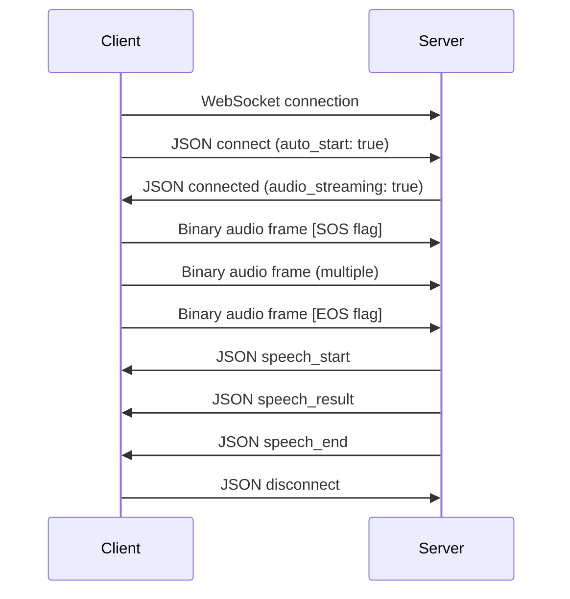

# WebSocket Application Layer Protocol Specification

## Overview
This protocol enables real-time bidirectional communication for audio streaming and control messaging over WebSocket connections. It supports binary audio data transmission and extensible JSON-based control commands.

## Message Types

### 1. Binary Frames (Audio Data)
- **Purpose**: Transmit raw audio data between client and server
- **Frame Type**: WebSocket Binary Frame (0x2)
- **Format**: Custom binary header + audio payload

### 2. Text Frames (Control Commands)
- **Purpose**: Exchange control messages and metadata
- **Frame Type**: WebSocket Text Frame (0x1)
- **Format**: JSON structure

## Protocol Details

### Binary Audio Frame Structure

```
[Header: 8 bytes] + [Audio Payload: variable length]

Header Format:
┌─────────┬─────────┬─────────────┬─────────────┐
│ Type    │ Flags   │ Sequence    │ Length      │
│ 1 byte  │ 1 byte  │ 2 bytes     │ 4 bytes     │
└─────────┴─────────┴─────────────┴─────────────┘
```

**Header Fields:**
- `Type` (1 byte): Audio format type
  - `0x01`: PCM 16-bit little-endian
  - `0x02`: Opus
  - `0x03`: AAC
  - `0x04`: G.711
- `Flags` (1 byte): Audio metadata flags
  - Bit 0: Start of speech (SOS)
  - Bit 1: End of speech (EOS)
  - Bit 2: Silence detection
  - Bit 3: Audio boost/clear
  - Bits 4-7: Reserved
- `Sequence` (2 bytes): Packet sequence number (0-65535, wraps around)
- `Length` (4 bytes): Audio payload length in bytes

### JSON Control Command Format

```json
{
  "type": "command_type",
  "id": "unique_message_id",
  "timestamp": 1701234567890,
  "payload": {
    // Command-specific data
  }
}
```

**Command Types:**

#### Connection and Audio Management
```json
// Connect and start audio streaming
{
  "type": "connect",
  "id": "msg_001",
  "payload": {
    "client_version": "1.0.0",
    "audio_formats": ["pcm16", "opus"],
    "sample_rate": 16000,
    "channels": 1,
    "auto_start": true
  }
}

// Connection acknowledgment with audio session info
{
  "type": "connected",
  "id": "msg_002",
  "payload": {
    "server_version": "1.0.0",
    "session_id": "session_abc123",
    "selected_format": "pcm16",
    "audio_streaming": true
  }
}

// Disconnect and stop audio streaming
{
  "type": "disconnect",
  "id": "msg_003",
  "payload": {
    "reason": "normal_close"
  }
}

```

#### Speech Recognition
```json
// Speech detection start
{
  "type": "speech_start",
  "id": "msg_007",
  "payload": {
    "confidence": 0.95
  }
}

// Speech results
{
  "type": "speech_result",
  "id": "msg_008",
  "payload": {
    "text": "Hello, world!",
    "confidence": 0.98,
    "is_final": true,
    "alternatives": [
      {"text": "Hello, world!", "confidence": 0.98},
      {"text": "Hello word!", "confidence": 0.02}
    ]
  }
}

// Speech detection end
{
  "type": "speech_end",
  "id": "msg_009",
  "payload": {
    "duration_ms": 2000
  }
}
```

#### Error Handling
```json
// Error message
{
  "type": "error",
  "id": "msg_010",
  "payload": {
    "code": 4001,
    "message": "Unsupported audio format",
    "details": {
      "requested_format": "unsupported_format",
      "supported_formats": ["pcm16", "opus"]
    }
  }
}
```

## Protocol Flow Example



## Implementation Guidelines

### Client-Side Implementation
```javascript
class AudioProtocolClient {
  constructor(url) {
    this.url = url;
    this.ws = null;
    this.messageId = 0;
  }

  connect() {
    this.ws = new WebSocket(this.url);
    this.ws.binaryType = 'arraybuffer';

    this.ws.onopen = () => {
      this.sendJSON({
        type: 'connect',
        id: this.getNextId(),
        payload: {
          client_version: '1.0.0',
          audio_formats: ['pcm16', 'opus'],
          sample_rate: 16000,
          channels: 1,
          auto_start: true
        }
      });
    };

    this.ws.onmessage = (event) => {
      if (event.data instanceof ArrayBuffer) {
        this.handleBinaryAudio(event.data);
      } else {
        this.handleJSONMessage(JSON.parse(event.data));
      }
    };
  }

  sendAudio(audioData, flags = 0) {
    const header = new Uint8Array(8);
    const view = new DataView(header.buffer);

    view.setUint8(0, 0x01); // PCM16 format
    view.setUint8(1, flags); // Flags
    view.setUint16(2, this.getNextSequence(), false); // Sequence
    view.setUint32(4, audioData.byteLength, false); // Length

    const message = new Uint8Array(header.byteLength + audioData.byteLength);
    message.set(header);
    message.set(new Uint8Array(audioData), header.byteLength);

    this.ws.send(message.buffer);
  }

  sendJSON(message) {
    this.ws.send(JSON.stringify(message));
  }
}
```

### Server-Side Implementation (Node.js)
```javascript
const WebSocket = require('ws');

class AudioProtocolServer {
  constructor(options) {
    this.wss = new WebSocket.Server(options);
    this.sessions = new Map();
  }

  start() {
    this.wss.on('connection', (ws, req) => {
      let session = {
        ws,
        id: this.generateSessionId(),
        audioState: 'idle'
      };

      ws.on('message', (data) => {
        if (data instanceof Buffer) {
          this.handleBinaryAudio(session, data);
        } else {
          this.handleJSONMessage(session, JSON.parse(data));
        }
      });

      ws.on('close', () => {
        this.sessions.delete(session.id);
      });
    });
  }

  handleBinaryAudio(session, data) {
    if (data.length < 8) return;

    const view = Buffer.from(data);
    const type = view.readUInt8(0);
    const flags = view.readUInt8(1);
    const sequence = view.readUInt16BE(2);
    const audioLength = view.readUInt32BE(4);
    const audioData = data.slice(8);

    // Process audio data...
  }

  sendJSON(session, message) {
    session.ws.send(JSON.stringify(message));
  }
}
```

## Error Codes

| Code | Description |
|------|-------------|
| 1000 | Normal closure |
| 1001 | Endpoint going away |
| 4001 | Unsupported audio format |
| 4002 | Invalid audio parameters |
| 4003 | Session already exists |
| 4004 | Session not found |
| 4005 | Invalid message format |
| 5001 | Internal server error |

## Performance Considerations

1. **Packet Size**: Keep audio packets under 64KB for optimal network performance
2. **Sequence Numbers**: Use modulo 65536 to handle sequence number wrapping
3. **Backpressure**: Implement buffering when network is congested
4. **Heartbeat**: Send ping/pong messages every 30 seconds to maintain connection

## Security Considerations

1. **WSS**: Always use secure WebSocket connections (wss://)
2. **Authentication**: Include API tokens in the initial connect message
3. **Rate Limiting**: Limit audio data transmission rates
4. **Input Validation**: Validate all JSON message formats and audio parameters

This protocol provides a robust foundation for real-time audio communication over WebSockets while maintaining extensibility through JSON control commands and efficiency through binary audio frames.